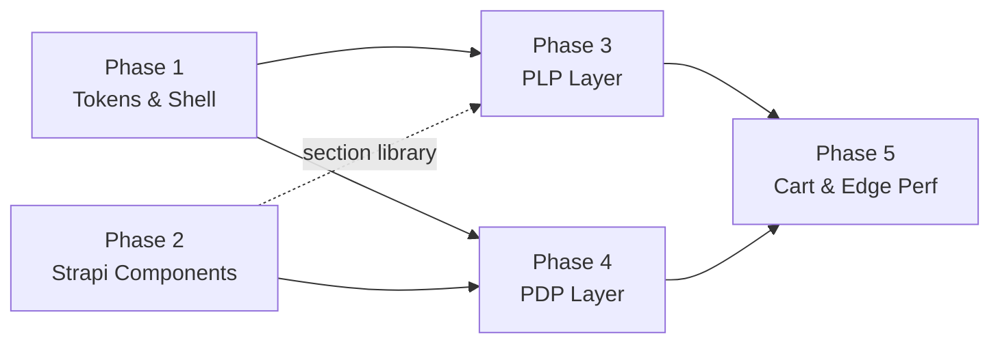

# PRODUCTION HARDENING PLAN — Hakeems Storefront

> Master blueprint from the global UI/UX + architecture audit (2026-07-16).
> Scope: `apps/storefront` (Next.js App Router, Tailwind v4 CSS-first tokens) + `apps/strapi` content schemas.
> Each phase is isolated, testable, and independently shippable. **No code in this document has been implemented — it is a plan awaiting approval.**

---

## Audit Verdict (what's solid vs. what's missing)

**Foundations that are genuinely strong — build on, don't rebuild:**

- **Token discipline**: `@theme` palette in `globals.css` (`--color-ink/paper/hairline/accent/sale`, `--spacing-section`), a constrained CMS color-token enum (`lib/design/color-tokens.ts`), and a single shared `CONTAINER` rhythm (`lib/ui.ts`) adopted across 23 files.
- **One overlay primitive** (`ui/overlay.tsx`) with focus trap, focus restore, scroll lock, Escape/backdrop close, and dialog semantics — cart drawer, search sheet, and mobile menu all share it.
- **Fully CMS-composed home page**: `Page` dynamic zone → exhaustive discriminated-union `SectionRenderer`. Reordering in Strapi reorders the page with zero code change.
- **Data-driven product card & PDP variant matrix**: swatches, per-color galleries, sale pricing, badges — nothing hardcoded.
- Reduced-motion handling on keyframe animations; `aria-pressed`/`aria-label` usage on swatches and icon buttons; breadcrumbs on PDP + collections.

**The gap classes (detailed per phase below):**

| # | Gap | Severity | Where |
|---|-----|----------|-------|
| 1 | No focus-visible ring system — 2 focus styles in the entire app | **Critical (a11y)** | Global |
| 2 | No mobile filter UI — facet sidebar is `hidden lg:block` | **Critical (conversion)** | PLP |
| 3 | Zero `loading.tsx` / `error.tsx` / Suspense / skeletons | **Critical (UX/resilience)** | All routes |
| 4 | Zero `next/image` — 11 files ship raw `` (no srcset/AVIF/priority) | **High (perf/LCP)** | Global |
| 5 | No active-filter pills, no clear-all, no price facet | High | PLP |
| 6 | Binary stock only — `LOW_STOCK` never surfaced ("Only 2 left" impossible) | High | PDP |
| 7 | No sticky mobile buy button; no gallery zoom/lightbox | High | PDP |
| 8 | Cart drawer has no Checkout CTA, no free-shipping threshold, no promo code anywhere | High | Cart/Checkout |
| 9 | Orphaned CMS components: `layout.collection-tile` allowed in dynamic zone but unrendered; `layout.value-item` fully unused | Medium (editor trap) | Strapi |
| 10 | Section library too thin for a flagship: no reviews, FAQ, newsletter, value-props, video, prose blocks | Medium | Strapi |
| 11 | Spacing drift (`py-16/14/12/8` beside `py-section*`), raw `text-red-600` bypassing `--color-sale`, mixed radius language, 32px touch targets on qty steppers | Medium | Global |
| 12 | Tabs (`role=tablist`) lack arrow-key nav + `aria-controls`/`id` pairing; no accordion presentation on mobile | Medium (a11y) | PDP |
| 13 | No optimistic cart updates — every qty change is a full server round trip with opacity-fade | Medium | Cart |
| 14 | Overlay/panel transitions ignore `prefers-reduced-motion` (keyframes handle it; transitions don't) | Low | Global |
| 15 | No z-index scale (ad-hoc `z-0/10/20/40/50`) | Low | Global |

---

## Phase 1 — Token Unification & Structural Shell

**Goal**: every interactive element keyboard-visible; one spacing/radius/z language; motion tokens; zero visual regression elsewhere.

1. **Focus system (a11y-critical)**
   - Add to `globals.css`: a `--ring` token + base rule `:where(a,button,input,select,textarea,[tabindex]):focus-visible { outline: 2px solid var(--color-ink); outline-offset: 2px; }` (accent ring on dark-ink surfaces).
   - Remove the `tabIndex={-1}` on the product-card image link *or* ensure the card title link is the canonical tab stop — verify a full keyboard walk of home → PLP → PDP → cart → checkout.
2. **Spacing normalization**
   - Sweep `py-16/py-14/py-12/py-8` page-level usages into `py-section` / `py-section-sm` (add `--spacing-section-xs: 2rem` if a third step is genuinely needed). Component-internal small paddings stay raw.
3. **Color-token enforcement**
   - Replace raw `text-red-600` (PDP error, `product-detail.tsx:134`) with `--color-sale`-derived `--color-danger` token; grep-gate: no `red-*`/`#hex` literals in `.tsx`.
4. **Radius + z-index scale**
   - Document the radius language (square media/buttons, `rounded-full` pills/swatches, `rounded-md` thumbnails) as tokens `--radius-pill/-thumb`; define `--z-nav/overlay/toast` and map existing `z-*` usages.
5. **Motion tokens + reduced-motion completeness**
   - `--duration-fast: 200ms / -base: 300ms / -slow: 500ms`; collapse the stray `duration-150/700`. Add a `@media (prefers-reduced-motion: reduce)` rule that zeroes `transition-duration` on the Overlay panel/backdrop and hero/carousel transforms.
6. **Touch targets**
   - Qty steppers (`h-8 w-8` → 44px hit area via padding/pseudo-expansion), card swatches (16px visual is fine; extend hit area), nav icon buttons ≥44px.

**Exit criteria**: axe-core clean on focus/contrast; keyboard-only purchase possible; visual diff limited to focus rings + spacing rhythm.

---

## Phase 2 — Strapi Content Component Alignment *(fills the numbering gap; unblocks Phases 3–4 content needs)*

**Goal**: an editor can compose a complete flagship page (hero → grid → rails → pillars → reviews → FAQ → newsletter) with no dead options and no code changes.

1. **Fix the editor traps**
   - Either implement a `layout.collection-tile` renderer case in `section-renderer.tsx` or remove it from the `Page.sections` dynamic zone. Delete or wire `layout.value-item` (natural fit: new `section.value-props`).
2. **New section components** (schema + zod schema in `lib/strapi/schemas.ts` + renderer case each — the discriminated-union pattern makes each a compile-checked, isolated PR):
   - `section.value-props` (reuses `layout.value-item`), `section.testimonials` / review wall, `section.faq` (accordion, reuses Phase-4 primitive), `section.newsletter`, `section.prose` (rich text), `section.video`, `section.spacer/divider` (token-constrained).
3. **PDP editorial layer**
   - New Strapi collection `product-page` keyed by `vendureProductSlug` (mirrors the proven `collection-page` sync pattern): rich-text panels (size guide, fabric tables), optional editorial banner under the buy box. Vendure custom fields stay the source for fit/care copy; Strapi adds long-form content.
4. **Deferred debt folded in** (from ENTERPRISE_POLISH_PLAN): hero-slide → `shared.media` composition; `(slug, channel)` uniqueness lifecycle.

**Exit criteria**: every dynamic-zone option renders something; a "kitchen-sink" draft page renders all sections correctly in both channels.

---

## Phase 3 — Advanced Shoppable PLP & Facet Filter Layer

**Goal**: filtering works for the mobile majority, state is always visible, and transitions never feel dead.

1. **Mobile filter drawer** — reuse `Overlay` (bottom sheet or right drawer): filter groups + result count + "View N items" apply button. The sidebar's URL-driven `buildToggleHref` logic is shared as-is.
2. **Active filter pills row** above the grid: one removable pill per active facet value + "Clear all" (URL-driven, server-rendered, works with no JS).
3. **Loading feedback** — route-level `loading.tsx` (grid skeleton matching card aspect `4/5`) + `useOptimistic`/`useTransition` pending state on sort/filter clicks so the current grid dims instead of freezing.
4. **Facet upgrades** — color facet renders swatch dots (reuse card swatch primitive); price-range facet (Vendure `priceRange` search input); collapsible facet groups with counts (native `
` styled, or Phase-4 accordion).
5. **Sort select restyle** — keep native `<select>` semantics, style the closed state (chevron icon, hairline border) to match the design language.
6. **`error.tsx`** for PLP routes: styled "catalog unavailable" with retry — a Vendure outage must not white-screen the shop.

**Exit criteria**: filter → result loop usable one-handed at 375px; Lighthouse CLS ≈ 0 on filter changes (skeletons reserve space); all filter state visible + individually dismissible.

---

## Phase 4 — Immersive Editorial PDP Layer

**Goal**: flagship-grade detail page: urgency, depth, and a buy action that never scrolls away.

1. **Sticky mobile buy bar** — price + size shortcut + Add to Cart pinned at viewport bottom on `< lg` once the primary button scrolls out (IntersectionObserver), safe-area padded.
2. **Inventory urgency** — plumb Vendure's `LOW_STOCK` (currently collapsed to a boolean in `lib/vendure/pdp.ts:85`): "Low stock — only a few left" indicator on variant selection; optionally a custom `StockDisplayStrategy` in Vendure to expose banded counts ("Only 2 left").
3. **Accordion primitive** (single shared component: `ui/accordion.tsx`, ARIA `button[aria-expanded]` + region pattern, height auto-animation, reduced-motion aware) — PDP tabs become accordions on mobile / stay tabs on desktop; same primitive powers Phase-2 FAQ and Phase-3 facet groups. Fix tab a11y while touching it: arrow-key nav, `id`/`aria-controls` pairing.
4. **Gallery depth** — `next/image` with `priority` on the first image (LCP), thumbnail rail becomes scrollable (`scrollbar-none`) instead of overflow-prone flex row, tap-to-zoom lightbox reusing `Overlay`, pinch/drag on touch.
5. **Post-add-to-cart moment** — on success, open the cart drawer (or a toast with drawer CTA) instead of only swapping button text; this is the single highest-leverage conversion fix on the PDP.
6. **Editorial content** — render Phase-2 `product-page` rich panels; "Complete the look" product rail (reuses `ProductRailBlock` with related-collection source).

**Exit criteria**: LCP < 2.5s on 4G for a PDP; add-to-cart→checkout path has zero dead ends; accordions/tabs pass keyboard + screen-reader checks.

---

## Phase 5 — Seamless Cart Mechanics & Global Edge Performance

**Goal**: cart interactions feel instant, thresholds motivate, and the whole app is layout-shift-free and resilient.

1. **Cart drawer conversion pass** — direct "Checkout" primary CTA (View Cart demotes to secondary); free-shipping progress bar (threshold from channel config/Strapi site-setting: "NPR X away from free shipping"); payment trust row (channel-aware: Stripe marks for HK, Fonepay for Nepal) above the CTA.
2. **Optimistic line-item state** — `useOptimistic` for qty/remove (instant UI, server reconciliation, error rollback + toast) replacing the fade-and-wait `router.refresh()` loop.
3. **Promotions surface** — promo-code input in checkout `OrderSummary` (Vendure `applyCouponCode`), discount lines rendered in summary + cart totals (currently silently omitted even when Vendure applies one).
4. **Global `next/image` migration** — all 11 raw-`` files: product cards (`sizes` per grid breakpoint), hero (priority), thumbnails; configure `remotePatterns` for the Vendure asset server + Strapi media. This closes the deferred ENTERPRISE_POLISH item.
5. **Zero-layout-shift sweep** — aspect-ratio boxes already reserve media space (keep); add explicit dimensions to nav logo/badges; skeletons from Phase 3 pattern extended to account/order pages; font loading already `next/font` variables (verify `display: swap`).
6. **Resilience shell** — root `error.tsx` + `not-found.tsx` styling parity; per-route error boundaries for checkout steps (a payment-step failure must not unmount the address data).

**Exit criteria**: CLS < 0.05 across templates; cart qty change paints < 100ms; Lighthouse Perf ≥ 90 mobile on home/PLP/PDP; promo + threshold features verified in both channels.

---

## Sequencing & Dependencies

- Phase 1 and Phase 2 are parallelizable (different apps).
- The accordion primitive (Phase 4.3) is consumed by Phases 2 and 3 — build it first within Phase 4 or hoist to Phase 1 if schedules overlap.
- Each numbered item above is sized to be an isolated PR with its own verification step.

## Verification Strategy (every phase)

1. `tsc --noEmit` + build in `apps/storefront` (and `apps/strapi` when schemas change — schema changes require a Strapi restart to sync DB).
2. Keyboard-only + VoiceOver pass on touched flows; axe-core scan.
3. Viewport matrix: 375 / 768 / 1024 / 1440.
4. Both channels (`/nepal`, `/hongkong`) — currency, shipping, payment surfaces differ.
5. Lighthouse (mobile) before/after on home, PLP, PDP for the perf-touching phases.
